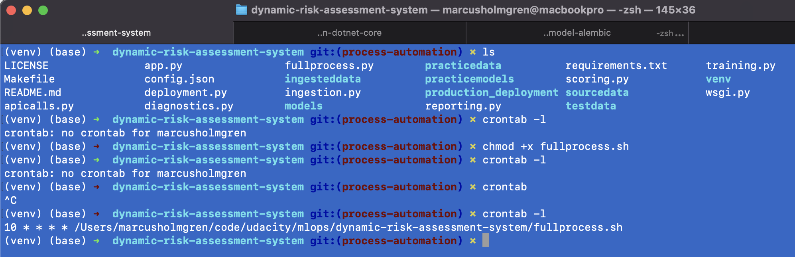

# A Dynamic Risk Assessment System

## Structure

Folder structure of the project:

* ingesteddata - folder containing the ouput from `ingestion.py` script.
* praticedata - folder containing input data files for `ingestion.py` script.
* praticemodels - folder that contains the model for the project. Produced by `training.py` & `scoring.py` scripts.
* production_deployment - folder that contains artifacts copied by the `deployment.py` script.
* sourcedata
* testdata

## Running the project

The `Makefile` contains the commands to run the project.


Start the REST API:
```bash
make run
```

Run script that invokes the REST API:
```bash
python apicalls.py
```
The output from the calls are writen to the file `practicemodels/apireturns.txt`

## Run continious

Ensure that the `fullprocess.sh` script can be executed.
```
chmod +x fullprocess.sh
```



## cURL API Examples

[cURL](https://curl.haxx.se/docs/manpage.html) examples for the API.

### /prediction

```bash
curl -X POST --location "http://localhost:8000/prediction" \
     -H "Content-Type: application/json; charset=utf-8" \
     -d "{ \"data_file\": \"testdata/testdata.csv\" }"
```

### /scoring
Get the F1 score for the trained model.

```bash
curl -X GET --location "http://localhost:8000/scoring"
```

### /summarystats
Get summary statistics from the numerical fields of the ingested data.
Reported as mean, median and standard deviation.

```bash
curl -X GET --location "http://localhost:8000/summarystats"
```

### /diagnostics
Get percentage of missing values and the timing of ingestion and model training.

```bash
curl -X GET --location "http://localhost:8000/diagnostics"
```
